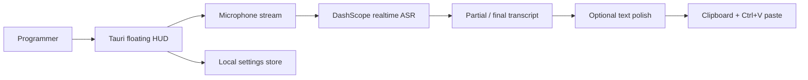

# Voice Input

Language: **English** | [中文](README.zh-CN.md)

A lightweight Tauri + React desktop voice-input HUD for programmers who want to dictate prompts, issues, and review comments quickly.

The app stays as a small always-on-top floating window. Start recording with a shortcut or button, watch realtime transcription, then copy or paste the final text into the current editor.

## Architecture



## Demo GIF


## Portfolio Metrics

Local demo targets and cost estimates; rerun before making production claims.

| Metric | Current portfolio baseline | Measurement note |
| --- | ---: | --- |
| Latency | P50 first partial target `< 1.2s` | Realtime ASR path, microphone to visible transcript |
| RAG hit rate | `N/A` | This project has no retrieval layer |
| Agent success rate | `N/A` | Single-purpose ASR HUD, no agent planner |
| Report generation time | `N/A` | No report generation workflow |
| Cost | `~$0.001-$0.006 / minute` | ASR-only estimate, depends on provider pricing and model |

## Features

- Floating desktop HUD: lightweight, always on top, draggable.
- Realtime speech-to-text through DashScope Qwen ASR.
- Optional text polishing, disabled by default for lower latency.
- Clipboard write and optional simulated `Ctrl+V`.
- Recent transcript history with privacy controls.
- API key stored locally, never committed to source.

## Requirements

- Windows 10/11
- Node.js 22+
- npm
- Rust toolchain
- Visual Studio C++ Build Tools
- DashScope API key with Qwen ASR access

## Run

```bat
start.cmd
```

Development mode:

```bat
dev.cmd
```

## Build

```bash
npm run lint
npm run build
npm run tauri build
```

Build artifacts are written to:

```text
src-tauri/target/release/bundle/
```

## Privacy

- Audio is streamed to DashScope for realtime recognition.
- Audio files are not saved by default.
- Transcript history can be disabled.
- Clipboard logging is disabled by default.
- Local secrets can be cleared with:

```powershell
powershell -ExecutionPolicy Bypass -File scripts/clear-local-secrets.ps1
```
