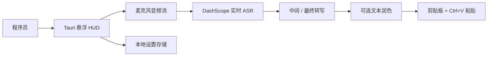
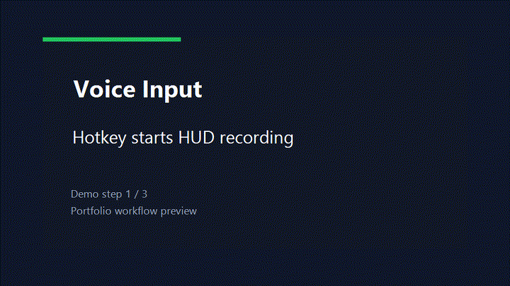

# Voice Input

语言： [English](README.md) | **中文**

一个轻量级的 Tauri + React 桌面语音输入悬浮窗，面向程序员在写 prompt、issue、review comment 时快速口述文本。

应用默认只显示一个置顶悬浮 HUD。通过快捷键或按钮开始说话，实时显示识别文本，结束后按设置复制或自动粘贴到当前输入位置。

## 架构



## 演示 GIF



## 作品集指标

本地 demo 目标和成本估算；用于生产宣传前应重新测试。

| 指标 | 当前作品集 baseline | 说明 |
| --- | ---: | --- |
| 延迟 | 首个中间结果 P50 目标 `< 1.2s` | 麦克风到可见转写文本 |
| RAG 命中率 | `N/A` | 本项目没有检索层 |
| Agent 成功率 | `N/A` | 单用途 ASR HUD，没有 Agent planner |
| 报告生成耗时 | `N/A` | 没有报告生成流程 |
| 成本 | `~$0.001-$0.006 / 分钟` | ASR 估算，取决于供应商价格和模型 |

## 功能

- 桌面悬浮窗：轻量、置顶、可拖动。
- 实时语音转文字：使用 DashScope Qwen ASR。
- 可选润色：默认关闭，低延迟优先。
- 写入剪贴板并可尝试模拟 `Ctrl+V`。
- 最近记录和隐私开关。
- API Key 只保存在本机，不写入源码。

## 环境要求

- Windows 10/11
- Node.js 22+
- npm
- Rust toolchain
- Visual Studio C++ Build Tools
- DashScope API Key，并开通 Qwen ASR 权限

## 运行

```bat
start.cmd
```

开发模式：

```bat
dev.cmd
```

## 构建

```bash
npm run lint
npm run build
npm run tauri build
```

构建产物位于：

```text
src-tauri/target/release/bundle/
```

## 隐私

- 音频会流式发送到 DashScope 做实时识别。
- 默认不保存音频文件。
- 可关闭转写历史。
- 剪贴板日志默认关闭。
- 可用脚本清理本地密钥：

```powershell
powershell -ExecutionPolicy Bypass -File scripts/clear-local-secrets.ps1
```
